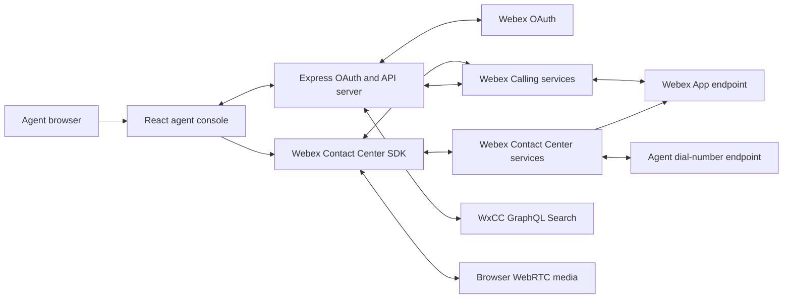
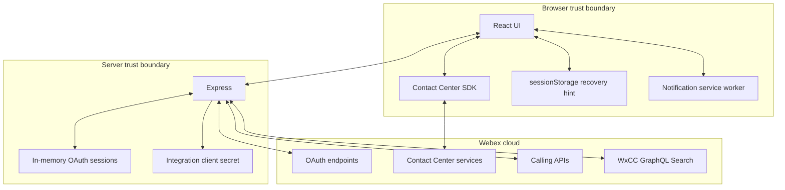
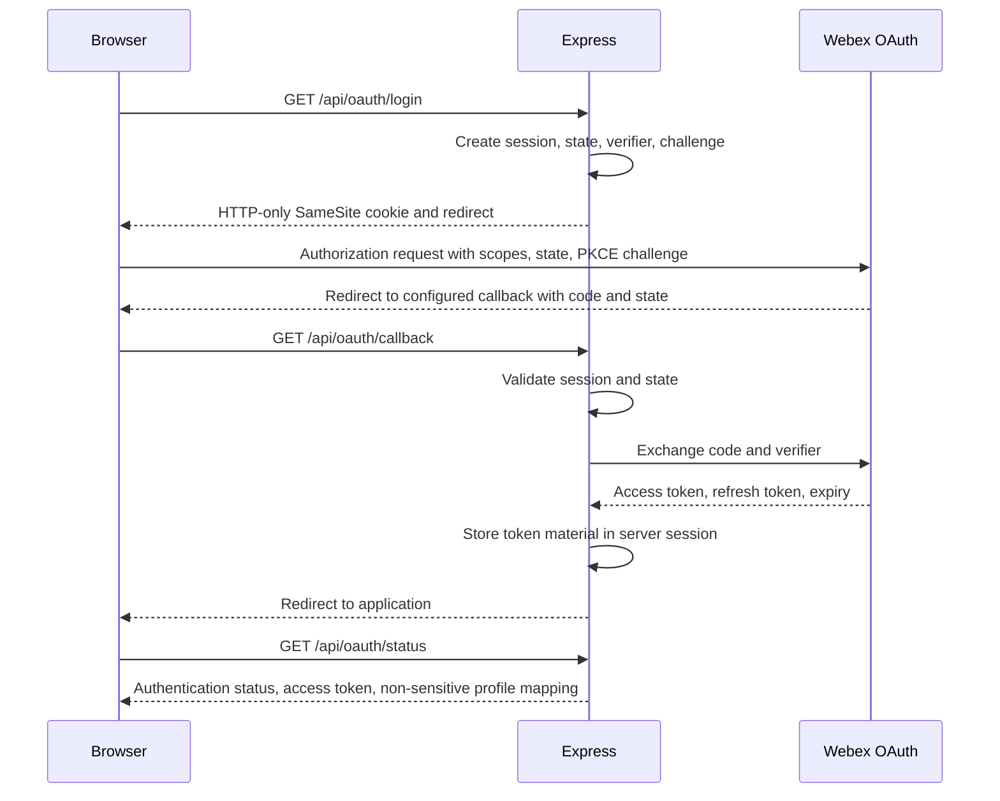
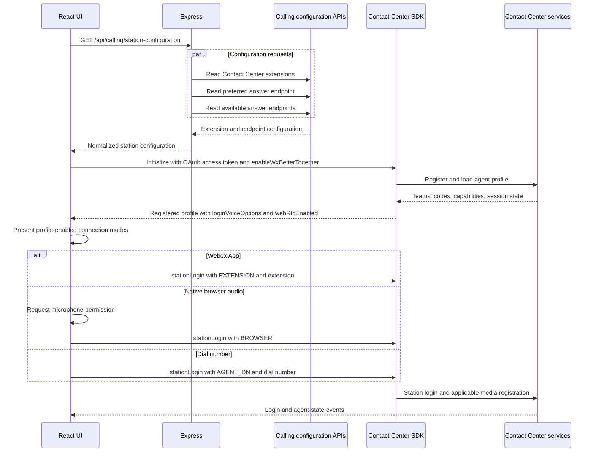
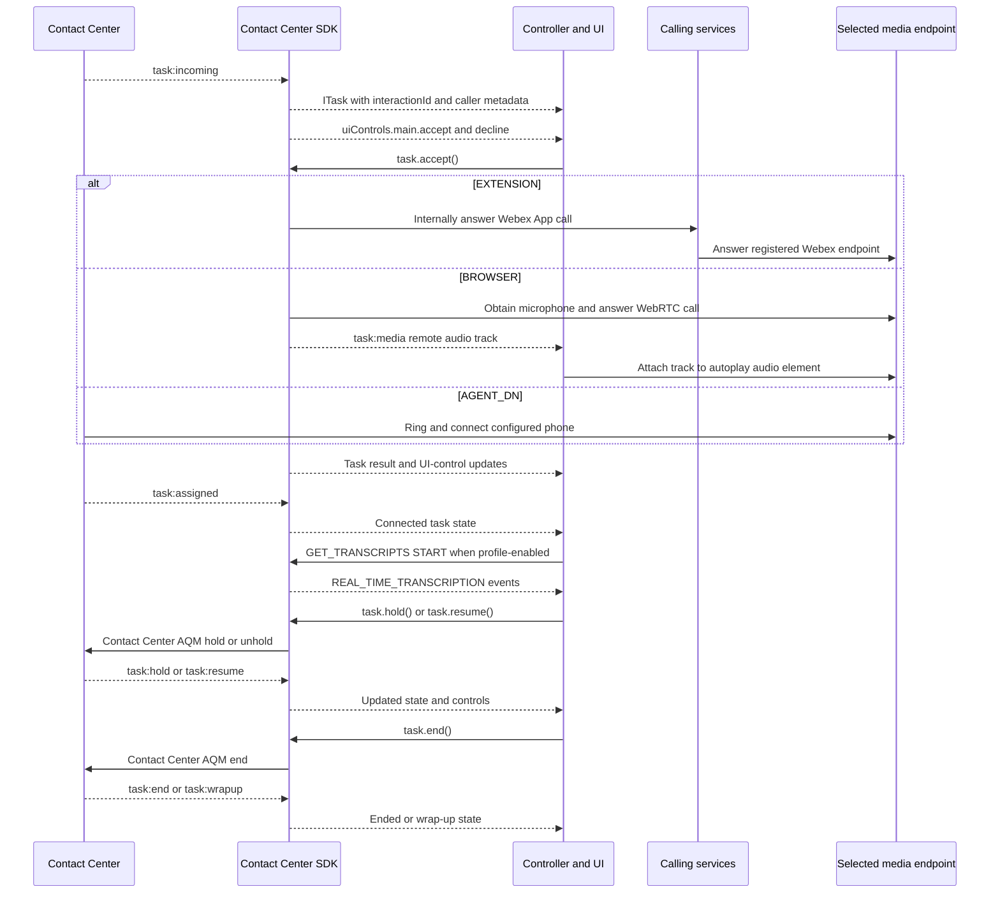
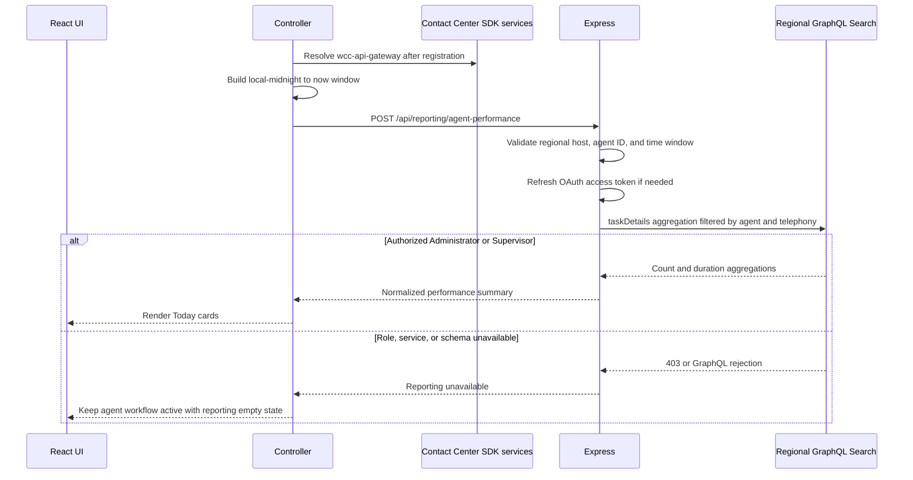
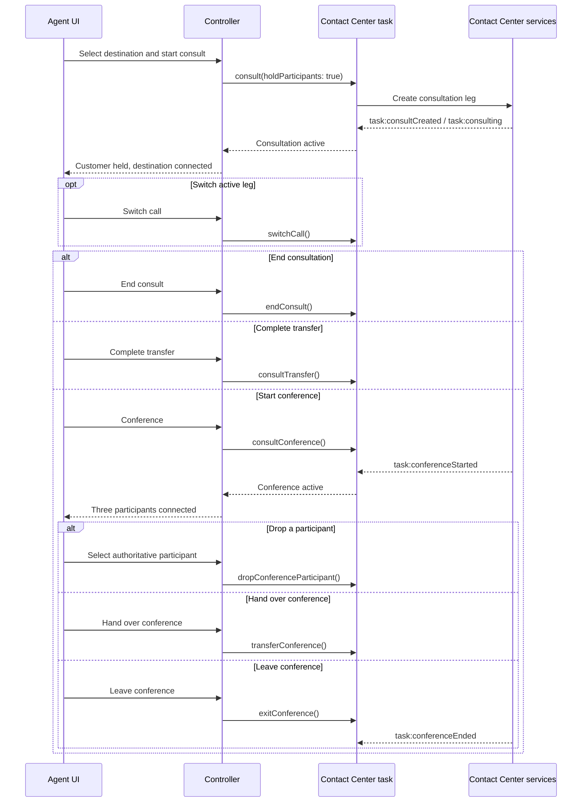
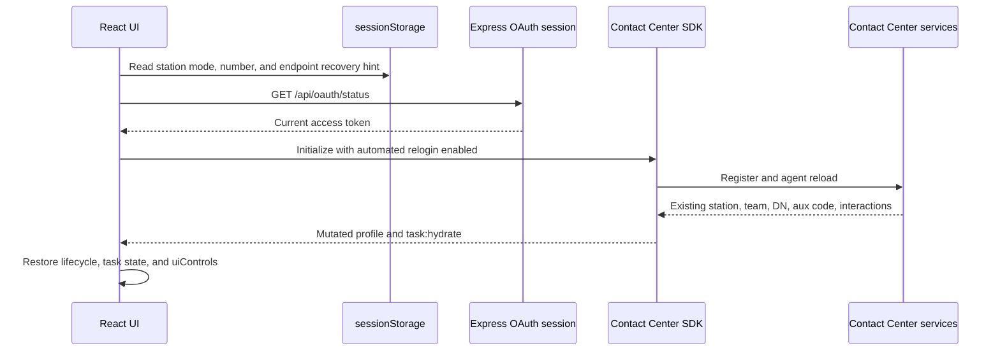

# Architecture

## 1. Purpose

The application provides a consolidated agent interface for Webex Contact Center voice interactions delivered through Webex App, native browser WebRTC, or an agent dial number.

The design separates interaction control from media control:

- Webex Contact Center owns agent registration, station state, routing tasks, recording, consult, conference, transfer, and wrap-up.
- The Contact Center SDK's Webex App Better Together path owns answer, decline, mute, unmute, and DTMF through the public task contract.
- Contact Center task operations own hold, resume, and end.
- Direct Webex Calling APIs are used only during setup for profile, extension, device, and preferred-endpoint configuration.
- The registered agent profile determines which station login modes are available.
- Webex App carries audio for extension login, the browser carries audio for WebRTC login, and the configured phone carries audio for dial-number login.

## 2. System context



The Contact Center SDK connects directly from the browser to Webex services, routes supported controls to the Webex App call, and owns task-state synchronization. Calling configuration requests are sent through the same-origin Express server so the OAuth refresh token and integration secret do not enter the browser bundle.

## 3. Component responsibilities

| Component | Responsibilities |
|---|---|
| `App.tsx` | Workflow composition, profile-driven station-mode selection, WebRTC permission and remote-audio binding, responsive lifecycle stage, persistent state control, call-control dock, consult/conference views, banners, theme, alerts, and diagnostics drawer |
| `InteractionInsights.tsx` | Primary conversation workspace with transcript lifecycle status and retry, historic/live transcript presentation, real-time AI assistance and feedback, mid-call/post-call summaries, active-session performance statistics, and interaction context |
| `WebexController.ts` | Contact Center lifecycle, three-mode station login, native task controls, browser media events, interaction context and participant normalization, transcript START/STOP coordination, AI Assistant events, optional performance loading, task state machine, and action coordination |
| `server.mjs` | OAuth, token refresh, HTTP-only session cookie, Calling configuration proxy, GraphQL Search proxy, diagnostics ingestion, static hosting |
| `callingApi.ts` | Typed same-origin client for server routes |
| `stationConfiguration.ts` | Extension and endpoint normalization and selection policy |
| `sessionRecovery.ts` | Minimal recovery hint storage and SDK profile-to-UI state mapping |
| `useCallAlerts.ts` | Default-on per-tab alert preference, ringtone, notification permission, visibility behavior, and service-worker messages |
| `call-alert-sw.js` | Notification click/action delivery to an existing browser client |
| `backendDiagnostics.ts` | Fire-and-forget delivery of allowlisted Contact Center lifecycle events to the server |

The Contact Center package is dynamically imported by the controller during initialization. Authentication and station-setup UI can load without downloading and evaluating the full SDK bundle first.

The application pins `@webex/contact-center` to `3.12.0-next.116` because the stable `3.12.0` package does not contain this task-based Webex App control path. The prerelease currently requires a local metrics declaration resolution in `tsconfig.app.json` and a narrow `consultTransfer()` task type augmentation; both are compatibility measures, not runtime forks of the SDK.

## 4. Trust boundaries



### Browser-held data

- Current OAuth access token returned by `/api/oauth/status` for SDK initialization
- UI state and active SDK objects in memory
- Recovery hint in `sessionStorage`: station mode, applicable dial number or extension, and Webex App answer-endpoint metadata
- Theme preference in `localStorage`
- HTTP-only session cookie, inaccessible to JavaScript

### Server-held data

- OAuth access token
- OAuth refresh token
- OAuth expiry
- PKCE verifier and OAuth state during authorization
- Derived user profile fields
- Integration client ID and client secret

The current server uses an in-memory `Map`; server-held session data is not durable.

## 5. OAuth sequence



The access token is returned because the browser-resident Contact Center SDK requires it. The client secret and refresh token remain server-side.

## 6. Station configuration and login



Teams are normalized because observed SDK payloads may use either `id`/`name` or `teamId`/`teamName`.

`loginVoiceOptions` gates the three UI connection cards. `webRtcEnabled` additionally gates browser audio. The endpoint selection policy applies only to Webex App mode and prefers an existing valid preference, then a single connected application endpoint, then a single usable endpoint. Ambiguous endpoint sets require user selection. `AGENT_DN` is validated by the SDK against the agent profile dial plan.

## 7. Incoming call sequence



No browser-side Calling `callId` is required. The SDK derives Webex App device identifiers from task participant data and correlates task operations with Contact Center backend events.

## 8. Task state and control policy

The UI treats the SDK task as the single source of truth for the active interaction:

- `task.uiControls.main` determines whether answer, decline, consult, transfer, and main-leg operations are enabled.
- `task.uiControls.activeLeg` selects the capability set for hold, mute, keypad, call-leg switching, conference, consult transfer, consult end, conference exit, and conference handoff.
- `task:ui-controls-updated` refreshes capability state.
- `task:assigned`, `task:hold`, and `task:resume` determine the connected and held presentation.
- `task:wxapp-mute-state-updated` synchronizes Webex App mute state.
- `task:media` supplies the remote audio track for browser WebRTC calls.
- `task:end`, `task:wrapup`, and `task:wrappedup` determine completion and cleanup.
- `task:hydrate` restores the task and controls after refresh.

Real-time transcription is a profile-gated companion lifecycle. After assignment, the controller sends an explicit `GET_TRANSCRIPTS` START request through `cc.apiAIAssistant.sendEvent()`. This is a compatibility fallback for task sequences in which the SDK receives a media-fork update but does not issue its automatic start request. Application-originated starts are deduplicated by interaction ID and paired with STOP on task end or wrap-up. The first transcript event establishes the active state; request failures stay within `transcriptionStatus` and do not change call state.

AI Assist and summary requests have an asynchronous acceptance/content boundary. `getRealTimeAssistance()` or `sendEvent()` resolving marks a request as accepted, not generated. `SUGGESTED_RESPONSE`, `MID_CALL_SUMMARY`, or `POST_CALL_SUMMARY` content marks it received; after 20 seconds without content the UI reports a delayed response and permits retry. The pinned SDK forwards transcript and suggested-response messages from its RTD manager but declares without forwarding the summary and acknowledgement variants. The controller therefore attaches a narrow read-only listener to that existing manager for `SUGGESTED_RESPONSE_ACKNOWLEDGE`, `MID_CALL_SUMMARY[_RESPONSE]`, and `POST_CALL_SUMMARY[_RESPONSE]`; interaction ID filtering prevents cross-task delivery. This compatibility listener can be removed once the pinned SDK forwards those declared events itself.

The application no longer lists active Calling calls, matches `interactionId` to `callId`, or polls `/telephony/calls`.

## 9. Control paths

### Calling configuration path

Express proxies only the setup APIs required to discover and persist the user's station configuration:

```text
GET /telephony/config/people/me
GET /telephony/config/people/me/settings/contactCenterExtensions
GET /telephony/config/people/me/settings/preferredAnswerEndpoint
GET /telephony/config/people/me/settings/availablePreferredAnswerEndpoints
PUT /telephony/config/people/me/settings/preferredAnswerEndpoint
```

There is no application-owned Calling call-control proxy.

### Reporting path

Reporting is optional and isolated from the operational call path:



The browser supplies the regional base URL discovered by the SDK, but Express accepts only HTTPS Webex Contact Center API hosts and discards any path before calling `/search`. The request uses the existing server-held OAuth session. It never logs the agent ID, token, query payload, or returned metric values.

The aggregation window uses `endedTime`, so active calls are intentionally excluded. `lastAgent.id` scopes results to completed telephony interactions for which the signed-in agent was the final handling agent. Search durations are milliseconds and are converted to seconds at the server boundary.

### Contact Center SDK path

These operations execute directly through the SDK:

- Register and deregister
- Station login using `BROWSER`, `EXTENSION`, or `AGENT_DN`, and station logout
- Agent state changes
- Webex App answer and decline through `task.accept()` and `task.decline()`
- Webex App mute and DTMF through `task.toggleMute({muted})` and `task.transmitDtmf({dtmf})`
- Hold, resume, and call end through `task.hold()`, `task.resume()`, and `task.end()`
- Recording-started, paused, and resumed presentation, with pause/resume capability taken from the active task leg's SDK UI control
- Queue and buddy-agent discovery
- Consult, transfer, consult transfer, and consult end
- Consult conference and conference exit
- Consult-leg switching, conference handoff, and participant removal
- Wrap-up
- Historic/live transcripts, real-time assistance and feedback, and summary requests through `cc.apiAIAssistant`

The controller initializes `cc.enableWxBetterTogether: true`, reads `task.uiControls` for action availability, listens for `task:ui-controls-updated`, synchronizes Webex App mute from `task:wxapp-mute-state-updated`, and forwards browser remote audio from `task:media`. The internal SDK helper names are not called by the application.

### Consult and conference path



`exitConference()` removes the current agent and leaves the customer and consulted party connected. Participant removal is enabled only for non-host participant rows backed by authoritative IDs in the SDK task participant map. Fallback display rows remain non-actionable.

## 10. Controller state model

The controller exposes an immutable snapshot to React subscribers.

### Lifecycle states

```text
signed-out
initializing
initialized
station-logged-in
available
idle
logging-out
error
```

### Call states

```text
none
ringing
answering
connected
held
wrap-up
ended
```

Contact Center task events are authoritative for call state, hold, completion, and wrap-up.

Consultation and conference are orthogonal task modes rather than additional call states:

```text
consultActive
conferenceActive
```

`task:consultCreated`, `task:consulting`, and `task:consultEnd` update consultation state. `task:conferenceStarted` and `task:conferenceEnded` update conference state. During refresh hydration, `isConsulted`, `isConferencing`, and `isConferenceInProgress` restore these modes.

Call and wrap-up timing use separate controller fields:

```text
callStartedAt -> callEndedAt       frozen call duration
wrapupStartedAt -> current clock   elapsed wrap-up time
```

The wrap-up event uses the current agent participant's `wrapUpTimestamp` when available and falls back to the local observation time. Hydrated wrap-up tasks use the same timestamp extraction, preventing the call clock from continuing during after-call work.

## 11. Responsive UI state

Desktop and mobile use the same React component tree, controller snapshot, and action handlers. CSS breakpoints reflow the top bar, station-mode cards, station details, state selector, call-control grid, consult actions, conference controls, and participant rows; there is no separate mobile application or duplicate SDK session.

Station setup deliberately has two progressive views rather than a persistent stepper. OAuth completion leads to one Contact Center connection action. After registration, the UI displays three recognizable connection cards and only the fields relevant to the selected mode. Unsupported profile modes remain visible but disabled so agents understand that the capability is controlled by their assigned profile rather than missing from the application.

The top bar contains a persistent agent-state selector and time-in-state display. It remains available for connected and held interactions, including consult and conference modes, and during pending wrap-up so the agent can select the next idle reason. It is disabled while ringing, answering, or executing another action. Selecting a value invokes the normal Contact Center agent-state API; Webex Contact Center remains authoritative for the resulting agent-state event. During wrap-up, the interaction header retains the frozen call duration and displays a separate after-call-work timer.

The active interaction uses a stable-width two-column desktop layout: a compact caller/lifecycle rail and a large conversation workspace where Transcript opens by default beside Assist, Summary, Statistics, and Call details tabs. The outer console and top bar retain the same aligned width across idle, ringing, connected, and wrap-up states. Incoming, connected-call, consult/transfer destination, keypad, and wrap-up actions use one bottom dock spanning both columns. Transient destination and keypad panels are positioned above the dock and their selectors open upward. At tablet and mobile breakpoints the same components stack vertically and the control dock becomes sticky with a three-column control grid. There is no separate mobile application, SDK instance, or navigation rail.

The idle workspace renders the optional `AgentPerformanceSummary` as a four-card responsive grid. Loading uses a compact skeleton, manual refresh does not block agent-state or station controls, and unavailable reporting remains an inline secondary state. The same component collapses from four to two columns on mobile.

The reporting request uses the signed-in OAuth identity. Its current-day window is browser-local midnight through request time. A completed no-wrap task, `task:wrappedup`, or successful manual wrap-up schedules a deduplicated refresh after two seconds so the home view can incorporate the completed interaction; ingestion latency can still require manual refresh. Webex requires `cjp:config` or `cjp:config_read` plus an Administrator or Supervisor role; scopes alone are insufficient. Authorization or schema failures update only `performanceStatus` and never the controller's lifecycle or call state.

## 12. Refresh recovery



The SDK and backend are authoritative. Stored browser data is only a signal to attempt recovery and a source for initialization preferences.

If `isAgentLoggedIn` is false, the UI returns to station login without creating a replacement station. If SDK initialization fails, the error is displayed and no cleanup request is sent automatically.

Conference hydration restores the conference mode from the task. Authoritative participant records are normalized from task data; temporary display rows are reconstructed only until that SDK data arrives.

## 13. Notification architecture

The alert feature is local to the browser and does not use a push subscription.

1. The agent enables Alerts through a user gesture.
2. The application resumes an `AudioContext` and requests notification permission.
3. A ringing task starts an oscillator-based ringtone.
4. When the document is hidden, the service-worker registration displays a persistent tagged notification.
5. Notification actions post `answer` or `decline` to an existing application client.
6. The React hook verifies the call key before invoking the controller action.
7. The notification closes when ringing ends or the page becomes visible.

If no client exists, selecting the notification body can open the application, but an action cannot reconstruct an expired SDK task or server session. Full closed-browser support would require Web Push or another server-initiated notification channel plus secure action authorization.

## 14. Operational logging

### Server-native events

Express logs OAuth operations, Calling configuration requests, GraphQL reporting outcomes, failures, duration, and startup directly. Reporting logs contain only outcome, reason, HTTP status when relevant, and aggregate field count; they exclude agent identifiers and metric values.

### Browser-originated events

Station and Contact Center task operations bypass Express. This includes answer, decline, hold, resume, mute, unmute, DTMF, and end. `backendDiagnostics.ts` sends their allowlisted, non-PII lifecycle events to:

```text
POST /api/diagnostics/events
```

The endpoint requires a valid session and same-origin request. Event name, outcome, state, action, station device type, destination type, booleans, and counts are allowlisted. Unknown fields are discarded.

### Log schema

```json
{
  "timestamp": "ISO-8601",
  "level": "info",
  "event": "cc.webex_call_control",
  "requestId": "random request identifier",
  "sessionRef": "truncated SHA-256 session reference",
  "outcome": "succeeded",
  "action": "accept"
}
```

Operational logs deliberately exclude PII, credentials, Webex identifiers, DTMF digits, and routing destinations. The agent-visible timeline is a separate diagnostic surface and may contain interaction-specific values.

Conference start and exit report the allowlisted `cc.conference` diagnostic event with only the `action` value (`start` or `exit`) and outcome. Participant identity is not sent to backend diagnostics.

## 15. Failure behavior

| Failure | Behavior |
|---|---|
| OAuth session missing | Server returns 401 and records `auth.session_required` |
| OAuth state mismatch | Callback is rejected before token exchange |
| Profile lookup failure | OAuth remains usable; UI shows a profile warning |
| Extension discovery failure | Webex App mode retains manual extension entry; browser and dial-number modes remain unaffected |
| Browser microphone blocked | Station login stops before WebRTC registration and the UI explains how to retry after changing site permission |
| Browser remote audio blocked | The application records an essential console error; the agent can restore site autoplay permission and retry the call |
| Unsupported station mode | The option remains visible but disabled based on `loginVoiceOptions` and `webRtcEnabled` |
| Contact Center initialization failure | Lifecycle becomes `error`; banner and backend diagnostic are emitted |
| No assigned team | Initialization fails with an explicit error |
| Station login failure | Existing configuration remains available for retry |
| Reporting role missing | Performance cards show an unavailable state; station and task workflows continue |
| Reporting query or regional service failure | Reporting exposes a retry action without changing lifecycle or call state |
| Transcript feature disabled in profile | Transcript tab reports the profile capability and sends no START request |
| Transcript START failure | Transcript tab retains a retry action; call handling continues unchanged |
| SDK task control failure | State is preserved or restored, an application banner is shown, and a non-PII diagnostic is reported |
| Declined offer | `task.decline()` rejects the Webex App call and the local task view clears after SDK success |
| Conference start failure | Consultation remains visible and the error is presented in the application banner |
| Conference exit failure | Conference state remains active and the agent can retry |
| Participant removal requested | UI keeps the action disabled until display rows are backed by authoritative SDK participant IDs |
| Wrap-up required | Contact Center task remains active until a wrap-up code succeeds |
| Refresh with valid backend session | Station, agent state, active task, and SDK task controls are restored |
| Refresh without backend session | UI returns to station login |

## 16. Deployment topology

The current deployment unit is one Node.js process:


The process binds to `0.0.0.0` and the `PORT` supplied by the platform. A single instance is required while sessions remain in memory. Free-tier spin-down, redeployment, or process restart removes OAuth sessions and requires sign-in again.

Infrastructure health checks use `GET /healthz`. The endpoint returns HTTP 204 without accessing OAuth sessions, calling Webex services, or generating an operational log. `/api/oauth/status` is an application endpoint and must not be used for platform health polling.

## 17. Production evolution

The minimum production architecture should add:

- An encrypted shared session store with expiry and revocation
- CSRF tokens and request rate limits
- Multi-tab and multi-device station ownership rules
- Centralized logs, metrics, traces, alerting, and retention controls
- Secret management and encryption-key rotation
- Automated browser compatibility tests
- Tenant-specific validation for scopes, U2C/SDK client authorization, features, and API availability
- Dependency vulnerability management and supported Webex SDK upgrade policy

Horizontal scaling is not safe until OAuth sessions are stored in a shared, durable service.
