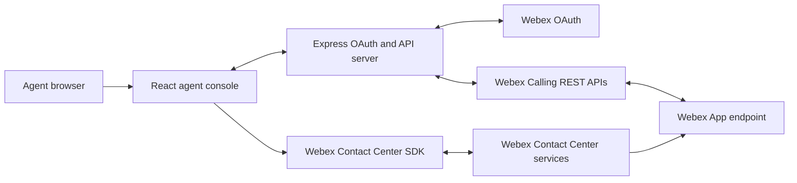
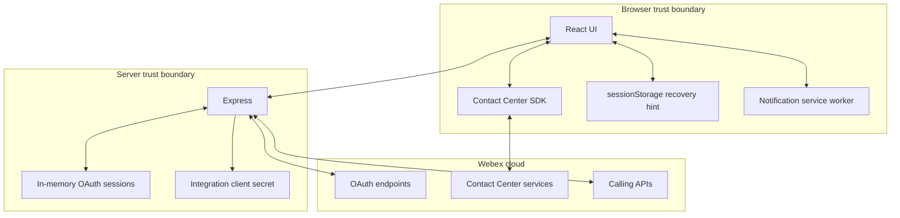
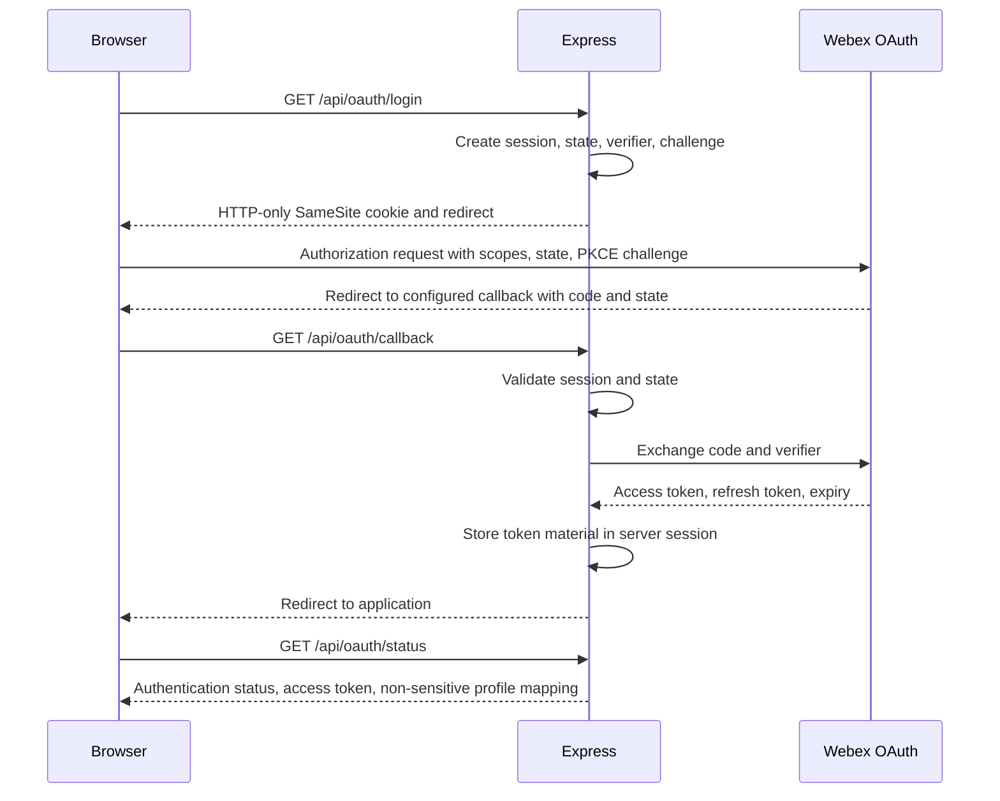
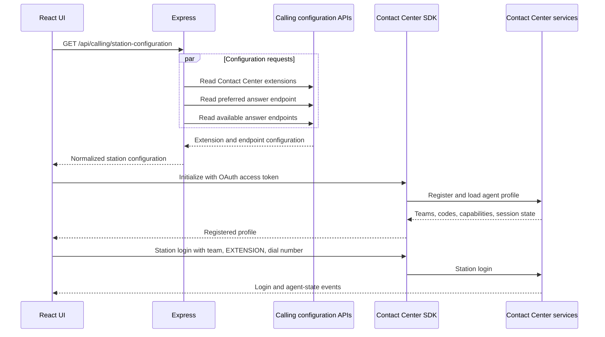
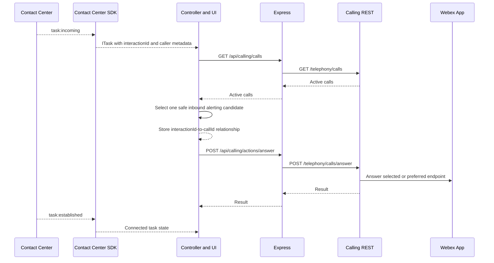
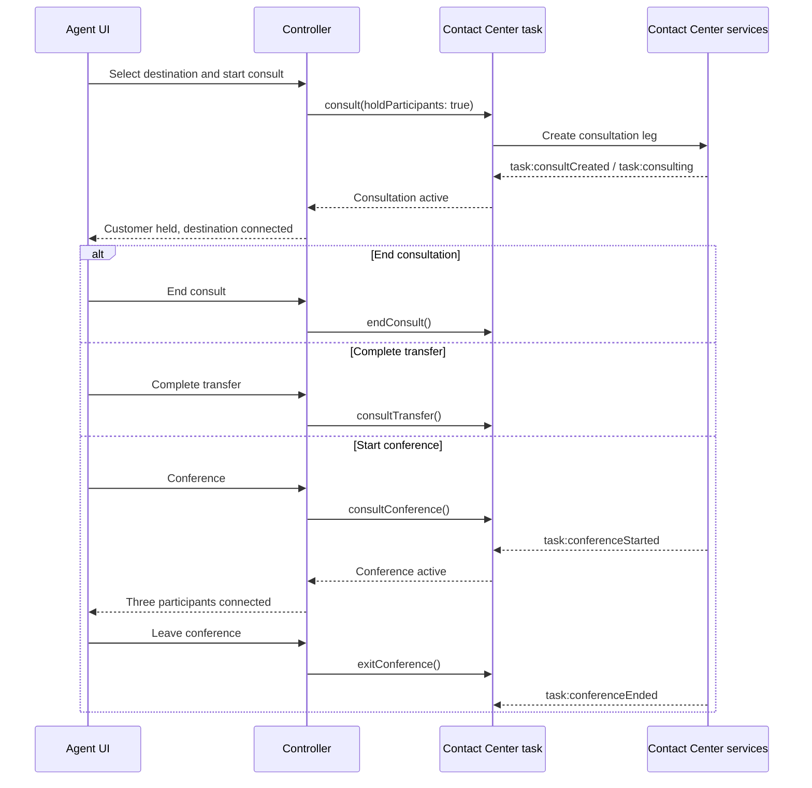
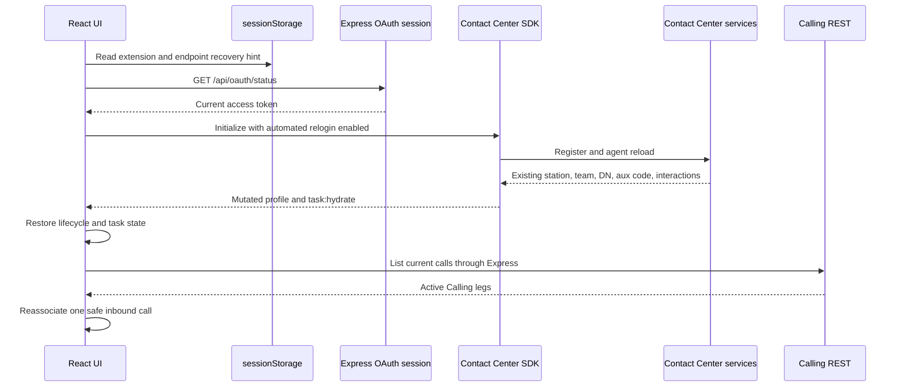
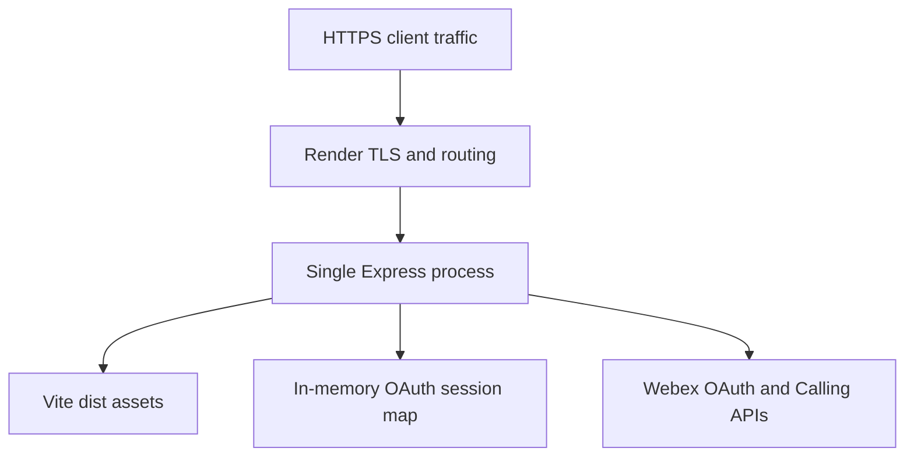

# Architecture

## 1. Purpose

The application provides a consolidated agent interface for Webex Contact Center voice interactions delivered to a Webex Calling extension.

The design separates interaction control from media control:

- Webex Contact Center owns agent registration, station state, routing tasks, recording, consult, conference, transfer, and wrap-up.
- Webex Calling owns the call presented to Webex App and exposes REST controls for that call.
- Webex App remains the registered endpoint and carries audio.
- The browser coordinates both systems but does not become a media endpoint.

## 2. System context



The Contact Center SDK connects directly from the browser to Webex services. Calling REST requests are sent through the same-origin Express server so the OAuth refresh token and integration secret do not enter the browser bundle.

## 3. Component responsibilities

| Component | Responsibilities |
|---|---|
| `App.tsx` | Workflow composition, form state, one responsive desktop/mobile UI, in-call next-state selection, consult/conference participant views, banners, menus, theme and alert controls |
| `WebexPocController.ts` | Contact Center lifecycle, task and conference events, state machine, Calling call association, polling, and action coordination |
| `server.mjs` | OAuth, token refresh, HTTP-only session cookie, Calling API proxy, diagnostics ingestion, static hosting |
| `callingApi.ts` | Typed same-origin client for server routes |
| `stationConfiguration.ts` | Extension and endpoint normalization and selection policy |
| `callMatching.ts` | Safe association of a WxCC task with a Calling REST call |
| `sessionRecovery.ts` | Minimal recovery hint storage and SDK profile-to-UI state mapping |
| `useCallAlerts.ts` | Ringtone, notification permission, visibility behavior, and service-worker messages |
| `call-alert-sw.js` | Notification click/action delivery to an existing browser client |
| `backendDiagnostics.ts` | Fire-and-forget delivery of allowlisted Contact Center lifecycle events to the server |

The Contact Center package is dynamically imported by the controller during initialization. Authentication and station-setup UI can load without downloading and evaluating the full SDK bundle first.

## 4. Trust boundaries



### Browser-held data

- Current OAuth access token returned by `/api/oauth/status` for SDK initialization
- UI state and active SDK objects in memory
- Recovery hint in `sessionStorage`: extension and answer-endpoint metadata
- Theme preference in `localStorage`
- HTTP-only session cookie, inaccessible to JavaScript

### Server-held data

- OAuth access token
- OAuth refresh token
- OAuth expiry
- PKCE verifier and OAuth state during authorization
- Derived user profile fields
- Integration client ID and client secret

The POC uses an in-memory `Map`; server-held session data is not durable.

## 5. OAuth sequence



The access token is returned because the browser-resident Contact Center SDK requires it. The client secret and refresh token remain server-side.

## 6. Station configuration and login



Teams are normalized because observed SDK payloads may use either `id`/`name` or `teamId`/`teamName`.

The endpoint selection policy prefers an existing valid preference, then a single connected application endpoint, then a single usable endpoint. Ambiguous endpoint sets require user selection.

## 7. Incoming call sequence



There is no assumption that `interactionId`, Webex correlation identifiers, and Calling `callId` have equal values. The relationship is established from call direction, lifecycle state, caller evidence, and time.

## 8. Call association policy

### New offer

Candidates must:

- Contain `callId` or `id`
- Have `personality === "terminator"`
- Have `state === "alerting"`

If one candidate remains, it is selected. With multiple candidates, caller-number equality or suffix matching receives the strongest score. Call creation proximity to the offer time is the secondary score. A tie is reported as ambiguous and Answer remains disabled.

The lookup uses bounded retries at 0, 250, 500, 1000, 1500, and 2000 milliseconds because Calling REST publication can lag the Contact Center task event.

### Recovered task

Recovery candidates may be `alerting`, `connected`, `held`, or `remoteHeld`. One candidate is selected directly. Multiple candidates require one unique caller-number match; otherwise controls remain disabled.

### Active synchronization

Once associated, the controller polls Calling REST every 1.5 seconds. It synchronizes call state, hold, mute capability, mute state, and endpoint. Two consecutive missing results are required before treating the Calling leg as ended.

## 9. Control paths

### Calling REST path

The browser sends state-changing actions only to same-origin Express routes. Express validates origin, session, action, call identifier, endpoint usage, and DTMF syntax before invoking Webex Calling.

```text
POST /api/calling/actions/answer
POST /api/calling/actions/hangup
POST /api/calling/actions/hold
POST /api/calling/actions/resume
POST /api/calling/actions/mute
POST /api/calling/actions/unmute
POST /api/calling/actions/transmitDtmf
```

Decline uses `hangup` against the alerting Calling leg. After success, the controller clears the local offered-task view so the ended intermediary does not block agent-state controls. Existing task listeners remain able to process a delayed Contact Center completion event.

### Contact Center SDK path

These operations execute directly through the SDK:

- Register and deregister
- Station login and station logout
- Agent state changes
- Recording pause and resume
- Queue and buddy-agent discovery
- Consult, transfer, consult transfer, and consult end
- Consult conference and conference exit
- Wrap-up

### Consult and conference path



`exitConference()` removes the current agent and leaves the customer and consulted party connected. The installed task API does not expose arbitrary remote-participant removal, so the UI presents participant identity and status without enabling Drop.

## 10. Controller state model

The controller exposes an immutable snapshot to React subscribers.

### Lifecycle states

```text
signed-out
initializing
initialized
station-logged-in
available
idle
logging-out
error
```

### Call states

```text
none
ringing
answering
connected
held
wrap-up
ended
```

### Association states

```text
none
locating
wxcc
ambiguous
```

Contact Center task events remain authoritative for wrap-up. Calling polling cannot overwrite `wrap-up` with `ended`.

Consultation and conference are orthogonal task modes rather than additional Calling REST states:

```text
consultActive
conferenceActive
```

`task:consultCreated`, `task:consulting`, and `task:consultEnd` update consultation state. `task:conferenceStarted` and `task:conferenceEnded` update conference state. During refresh hydration, `isConsulted`, `isConferencing`, and `isConferenceInProgress` restore these modes.

## 11. Responsive UI state

Desktop and mobile use the same React component tree, controller snapshot, and action handlers. CSS breakpoints reflow the top bar, state selector, call-control grid, consult actions, conference controls, and participant rows; there is no separate mobile application or duplicate SDK session.

The active-interaction heading contains an `After this call` selector. It is available for `connected` and `held` interactions, including consult and conference modes, and is disabled while ringing, answering, wrapping up, or executing another action. Selecting a value invokes the normal Contact Center agent-state API; Webex Contact Center remains authoritative for the resulting agent-state event.

## 12. Refresh recovery



The SDK and backend are authoritative. Stored browser data is only a signal to attempt recovery and a source for initialization preferences.

If `isAgentLoggedIn` is false, the UI returns to station login without creating a replacement station. If SDK initialization fails, the error is displayed and no cleanup request is sent automatically.

Conference hydration restores the conference mode before Calling-call reassociation. Known participant labels are reconstructed from the agent, caller, and consulted-destination state available to the POC; this is not a complete conference roster service.

## 13. Notification architecture

The alert feature is local to the browser and does not use a push subscription.

1. The agent enables Alerts through a user gesture.
2. The application resumes an `AudioContext` and requests notification permission.
3. A ringing task starts an oscillator-based ringtone.
4. When the document is hidden, the service-worker registration displays a persistent tagged notification.
5. Notification actions post `answer` or `decline` to an existing application client.
6. The React hook verifies the call key before invoking the controller action.
7. The notification closes when ringing ends or the page becomes visible.

If no client exists, selecting the notification body can open the application, but an action cannot reconstruct an expired SDK task or server session. Full closed-browser support would require Web Push or another server-initiated notification channel plus secure action authorization.

## 14. Operational logging

### Server-native events

Express logs OAuth operations, Calling configuration requests, Calling call controls, failures, duration, and startup directly.

### Browser-originated events

Station and Contact Center task operations bypass Express. `backendDiagnostics.ts` sends lifecycle events to:

```text
POST /api/diagnostics/events
```

The endpoint requires a valid session and same-origin request. Event name, outcome, state, action, destination type, booleans, and counts are allowlisted. Unknown fields are discarded.

### Log schema

```json
{
  "timestamp": "ISO-8601",
  "level": "info",
  "event": "calling.call_control",
  "requestId": "random request identifier",
  "sessionRef": "truncated SHA-256 session reference",
  "outcome": "succeeded",
  "action": "answer",
  "durationMs": 250
}
```

Operational logs deliberately exclude PII, credentials, Webex identifiers, DTMF digits, and routing destinations. The agent-visible timeline is a separate POC diagnostic surface and may contain interaction-specific values.

Conference start and exit report the allowlisted `cc.conference` diagnostic event with only the `action` value (`start` or `exit`) and outcome. Participant identity is not sent to backend diagnostics.

## 15. Failure behavior

| Failure | Behavior |
|---|---|
| OAuth session missing | Server returns 401 and records `auth.session_required` |
| OAuth state mismatch | Callback is rejected before token exchange |
| Profile lookup failure | OAuth remains usable; UI shows a profile warning |
| Extension discovery failure | Manual extension entry remains available |
| Contact Center initialization failure | Lifecycle becomes `error`; banner and backend diagnostic are emitted |
| No assigned team | Initialization fails with an explicit error |
| Station login failure | Existing configuration remains available for retry |
| No Calling call found | Contact Center task remains visible; Calling controls stay disabled |
| Multiple plausible calls | Association becomes `ambiguous`; no call is selected |
| Calling control failure | State is preserved or restored and a server error event is recorded |
| Calling leg disappears | Two missing polls mark media ended unless Contact Center is already in wrap-up |
| Declined offer | Calling leg is ended and the local task view is cleared immediately |
| Conference start failure | Consultation remains visible and the error is presented in the application banner |
| Conference exit failure | Conference state remains active and the agent can retry |
| Participant removal requested | UI keeps the action disabled because no supported task method is exposed |
| Wrap-up required | Contact Center task remains active until a wrap-up code succeeds |
| Refresh with valid backend session | Station, agent state, task, and Calling association are restored |
| Refresh without backend session | UI returns to station login |

## 16. Deployment topology

The current deployment unit is one Node.js process:



The process binds to `0.0.0.0` and the `PORT` supplied by the platform. A single instance is required while sessions remain in memory. Free-tier spin-down, redeployment, or process restart removes OAuth sessions and requires sign-in again.

Infrastructure health checks use `GET /healthz`. The endpoint returns HTTP 204 without accessing OAuth sessions, calling Webex services, or generating an operational log. `/api/oauth/status` is an application endpoint and must not be used for platform health polling.

## 17. Production evolution

The minimum production architecture should add:

- An encrypted shared session store with expiry and revocation
- CSRF tokens and request rate limits
- Multi-tab and multi-device station ownership rules
- Calling webhooks instead of per-browser polling
- A server-to-browser event channel such as WebSocket or Server-Sent Events
- Centralized logs, metrics, traces, alerting, and retention controls
- Secret management and encryption-key rotation
- Automated browser compatibility tests
- Tenant-specific validation for scopes, U2C/SDK client authorization, features, and API availability
- Dependency vulnerability management and supported Webex SDK upgrade policy

Horizontal scaling is not safe until OAuth sessions and any server-side call-correlation state are shared or externally coordinated.
